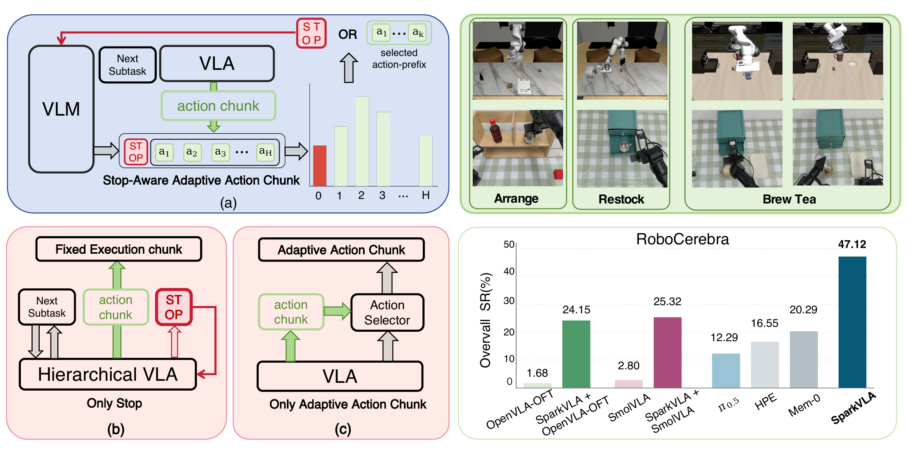

<h1 align="center">
SparkVLA: Stop-Aware Hierarchical VLA with Adaptive Action Chunking for Long-Horizon Manipulation
</h1>

    <a href="https://icr-lab.github.io/Spark-VLA/">Project Page</a> |
    <a href="">Paper</a> |
    <a href="https://github.com/huhuhushou/Spark-VLA">Code</a>

SparkVLA is a stop-aware hierarchical Vision-Language-Action framework for long-horizon manipulation. It formulates subtask termination and adaptive execution-length selection as a single ranking problem in which Stop competes against every action-prefix candidate. A history-aware subtask anchor and anchor-conditioned context encoding provide goal semantics and persistent onset-state memory for efficient decision-making at chunk boundaries.

# TODO List
- &#9744; Release paper
- &#9744; Release training code
- &#9744; Release evaluation code
- &#9744; Release model checkpoints
